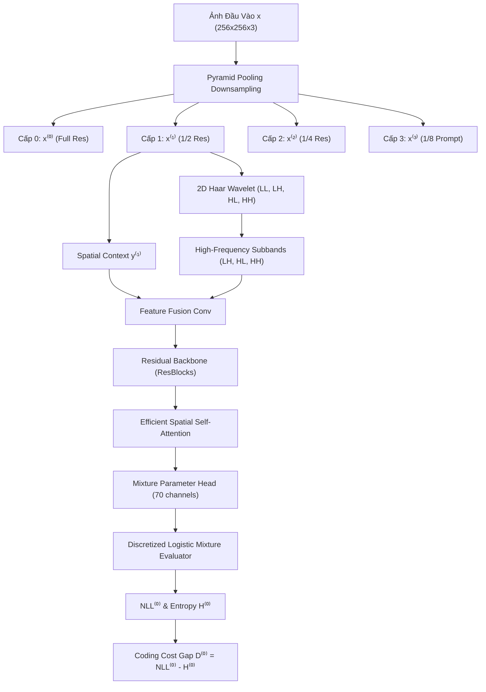

# 📄 Tài Liệu Kiến Trúc & Thuật Toán Mô Hình Advanced ZED
> **Mô hình Phát hiện Ảnh AI Zero-Shot Nâng Cấp (Frequency-Domain Wavelet + Efficient Spatial Attention + Robust Augmentation)**

---

## 📑 Mục Lục
1. [Tổng Quan & Động Lực Nghiên Cứu](#1-tổng-quan--động-lực-nghiên-cứu)
2. [Sơ Đồ Kiến Trúc Tổng Thể (System Architecture)](#2-sơ-đồ-kiến-trúc-tổng-thể-system-architecture)
3. [Cơ Sở Toán Học & Công Thức Chính](#3-cơ-sở-toán-học--công-thức-chính)
   - [3.1. Discrete Logarithmic Mixture Distribution (SReC)](#31-discrete-logarithmic-mixture-distribution-srec)
   - [3.2. Phân Tách 2D Haar Wavelet Decomposition (DWT)](#32-phân-tách-2d-haar-wavelet-decomposition-dwt)
   - [3.3. Efficient Spatial Cross-Attention](#33-efficient-spatial-cross-attention)
   - [3.4. Chỉ Số Thống Kê Quyết Định Zero-Shot ($D^{(0)}, \Delta^{01}$)](#34-chỉ-số-thống-kê-quyết-định-zero-shot-d0-\delta01)
4. [Luồng Huấn Luyện & Robust Augmentations](#4-luồng-huấn-luyện--robust-augmentations)
5. [Luồng Suy Luận Phát Hiện Ảnh AI (Zero-Shot Inference)](#5-luồng-suy-luận-phát-hiện-ảnh-ai-zero-shot-inference)
6. [Bảng So Sánh ZED Tiêu Chuẩn vs Advanced ZED](#6-bảng-so-sánh-zed-tiêu-chuẩn-vs-advanced-zed)

---

## 1. 🎯 Tổng Quan & Động Lực Nghiên Cứu

Các mô hình sinh ảnh AI hiện đại (DALL-E 3, Midjourney v5, SDXL, StyleGAN, DiT) phát triển liên tục khiến các bộ phát hiện có giám sát (Supervised Detectors) bị lỗi thời vì phải retrain liên tục.

Mô hình **ZED (Zero-shot Entropy-based Detector)** tiếp cận theo hướng **chỉ học phân bố của ảnh thật** thông qua mô hình nén mật độ không mất dữ liệu (**SReC**). Tuy nhiên, ZED gốc có 2 điểm yếu lớn:
1. **Chỉ phân tích trên miền không gian (Spatial Domain):** Dễ bỏ sót các vết nhiễu vi mô ở dải tần số cao do thuật toán Diffusion/GAN để lại.
2. **Receptive Field bị giới hạn bởi CNN:** Khó bắt được tương quan ngữ cảnh toàn cục giữa các vùng ảnh xa nhau.
3. **Báo động giả khi ảnh thật bị nén JPEG trên Internet:** Khi ảnh thật bị nén lại, phân bố pixel bị làm nhiễu khiến mô hình nén nhầm là ảnh AI.

👉 **Advanced ZED** ra đời để giải quyết triệt để 3 vấn đề trên thông qua **2D Haar Wavelet Decomposition**, **Efficient Spatial Self-Attention**, và **Robust Data Augmentation Pipeline**.

---

## 2. 🏗️ Sơ Đồ Kiến Trúc Tổng Thể (System Architecture)

---

## 3. 📐 Cơ Sở Toán Học & Công Thức Chính

### 3.1. Discrete Logarithmic Mixture Distribution (SReC)
Phân bố xác suất của một điểm ảnh $x \in \{0, \dots, 255\}$ được mô hình hóa bằng hỗn hợp $K=10$ phân bố Logistic rời rạc:

$$P(x \mid X) = \sum_{k=1}^{K} w_k \cdot \text{logistic}(x \mid \mu_k, s_k)$$

Trong đó:
- $w_k = \text{softmax}(a_k)$ là trọng số hỗn hợp ($a_k$ là output logits).
- $\text{logistic}(x \mid \mu, s) = \sigma\left(\frac{x - \mu + 0.5}{s}\right) - \sigma\left(\frac{x - \mu - 0.5}{s}\right)$.
- Với giá trị biên $x = 0 \Rightarrow P(x) = \sigma\left(\frac{0.5 - \mu}{s}\right)$ và $x = 255 \Rightarrow P(x) = 1 - \sigma\left(\frac{254.5 - \mu}{s}\right)$.

**Chi phí mã hóa thực tế (Negative Log-Likelihood - NLL):**
$$\text{NLL}_{i,j} = -\log_2 P(x_{i,j} \mid X_{i,j}) \quad (\text{đơn vị: bits/pixel})$$

**Độ hỗn loạn kỳ vọng (Expected Entropy - H):**
$$H_{i,j} = -\sum_{v=0}^{255} P(v \mid X_{i,j}) \log_2 P(v \mid X_{i,j})$$

---

### 3.2. Phân Tách 2D Haar Wavelet Decomposition (DWT)
Ma trận bộ lọc Haar 2D thực hiện phân tách kênh không gian $x$ thành 4 băng tần:

$$\begin{aligned}
h_{LL} &= \frac{1}{2}\begin{pmatrix} 1 & 1 \\ 1 & 1 \end{pmatrix}, \quad h_{LH} = \frac{1}{2}\begin{pmatrix} -1 & -1 \\ 1 & 1 \end{pmatrix} \\
h_{HL} &= \frac{1}{2}\begin{pmatrix} -1 & 1 \\ -1 & 1 \end{pmatrix}, \quad h_{HH} = \frac{1}{2}\begin{pmatrix} 1 & -1 \\ -1 & 1 \end{pmatrix}
\end{aligned}$$

Đặc trưng tần số cao (High-Frequency Features):
$$\text{HF} = \text{Concat}\left(LH, HL, HH\right) \in \mathbb{R}^{B \times 3C \times \frac{H}{2} \times \frac{W}{2}}$$

Đặc trưng tần số cao $\text{HF}$ sau đó được upscale lên độ phân giải mục tiêu $(H, W)$ và nối (concatenate) với đặc trưng không gian $y^{(l+1)}$ để đưa vào mạng CNN.

---

### 3.3. Efficient Spatial Cross-Attention
Để tránh bùng nổ bộ nhớ $O((HW)^2)$ khi $H=W=256$, thuật toán **Efficient Spatial Attention** giảm chiều không gian của Key ($K$) và Value ($V$) thông qua Adaptive Pooling về lưới cố định $16 \times 16$:

$$\begin{aligned}
Q &= \text{Conv}_q(\text{Norm}(X)) \in \mathbb{R}^{B \times d \times (HW)} \\
K &= \text{Conv}_k(\text{AdaptivePool}_{16 \times 16}(\text{Norm}(X))) \in \mathbb{R}^{B \times d \times 256} \\
V &= \text{Conv}_v(\text{AdaptivePool}_{16 \times 16}(\text{Norm}(X))) \in \mathbb{R}^{B \times d \times 256}
\end{aligned}$$

Ma trận ma sát Attention:
$$\text{Attention}(Q, K, V) = \text{softmax}\left(\frac{Q K^T}{\sqrt{d_k}}\right) V$$

*Độ phức tạp bộ nhớ:* Giảm từ **1 TB (nếu dùng Full Attention)** xuống chỉ còn **~16 MB**, cho phép chạy mượt mà trên CPU/GPU phổ thông.

---

### 3.4. Chỉ Số Thống Kê Quyết Định Zero-Shot ($D^{(0)}, \Delta^{01}$)
Khoảng hẫng chi phí mã hóa (Coding Cost Gap) tại cấp $l$:
$$D^{(l)} = \text{NLL}^{(l)} - H^{(l)}$$

- **Ảnh thật (Real Image):** $NLL^{(0)} \approx H^{(0)} \Rightarrow D^{(0)} \approx 0$ (mô hình dự đoán chính xác phân bố).
- **Ảnh AI (Synthetic Image):** $NLL^{(0)} > H^{(0)} \Rightarrow D^{(0)} > 0$ (mô hình bị "bất ngờ" bởi phân bố giả).
- **Độ dốc giữa các cấp độ phân giải:**
  $$\Delta^{01} = D^{(0)} - D^{(1)}$$

Phân loại Zero-Shot dựa trên so sánh giá trị $D^{(0)}$ hoặc $|\Delta^{01}|$ với ngưỡng tối ưu $\tau^*$.

---

## 4. 🔄 Luồng Huấn Luyện & Robust Augmentations

Huấn luyện **CHỈ TRÊN ẢNH THẬT (Real Images Only)** với hàm mất mát tổng các cấp:

$$\mathcal{L}_{total} = \text{NLL}^{(0)} + \text{NLL}^{(1)} + \text{NLL}^{(2)}$$

### Pipeline Augmentation Chống Nhiễu/Nén (`zed/augmentations.py`):
1. **Dynamic JPEG Compression:** Nén JPEG ngẫu nhiên với Quality $Q \in [50, 95]$ ($p=0.5$).
2. **Additive Gaussian Noise:** Nhiễu hạt cảm biến camera $\sigma \in [0, 0.03]$ ($p=0.3$).
3. **Random Scale & Resizing:** Co giãn nhẹ $1.1\times$ và Random Crop $256 \times 256$.

---

## 5. ⚡ Luồng Suy Luận Phát Hiện Ảnh AI (Zero-Shot Inference)

1. Nạp ảnh kiểm thử $x \in \{0, \dots, 255\}^{N \times M \times 3}$.
2. Tạo kim tự tháp đa độ phân giải $x^{(0)}, x^{(1)}, x^{(2)}, x^{(3)}$ bằng $2 \times 2$ Average Pooling.
3. Chạy qua `AdvancedSReCCNN` tích hợp Wavelet & Attention để dự đoán tham số $(w_k, \mu_k, s_k)$.
4. Tính bản đồ NLL rời rạc và exact Expected Entropy $H$.
5. Trích xuất chỉ số $D^{(0)} = \text{NLL}^{(0)} - H^{(0)}$ và $|\Delta^{01}|$.
6. Nối chỉ số với ngưỡng $\tau^*$ để xuất kết quả:
   - Nếu $D^{(0)} > \tau^* \Rightarrow$ **AI-Generated Image (Fake)**.
   - Nếu $D^{(0)} \le \tau^* \Rightarrow$ **Real Image**.

---

## 6. 📊 Bảng So Sánh ZED Tiêu Chuẩn vs Advanced ZED

| Đặc Tính | ZED Tiêu Chuẩn (Original Paper) | Advanced ZED (Triển khai mới) |
| :--- | :--- | :--- |
| **Miền phân tích** | Spatial Domain (Pixels) | Spatial + Frequency Domain (2D Haar Wavelet) |
| **Bắt nhiễu vi mô AI** | Trung bình | Rất cao (xem xét dải tần LH, HL, HH) |
| **Receptive Field** | Cục bộ (Local CNN 3x3) | Toàn cục (Efficient Spatial Self-Attention) |
| **Khả năng chống nén JPEG** | Dễ bị báo động giả (False Alarm) | Cao (nhờ Robust Augmentation Pipeline) |
| **Quản lý Bộ nhớ** | Chuẩn | Tối ưu $O(HW \cdot K_{grid}^2)$ - Không bị OOM |
| **Huấn luyện** | Chỉ cần ảnh thật | Chỉ cần ảnh thật (bổ sung Augmentation) |
