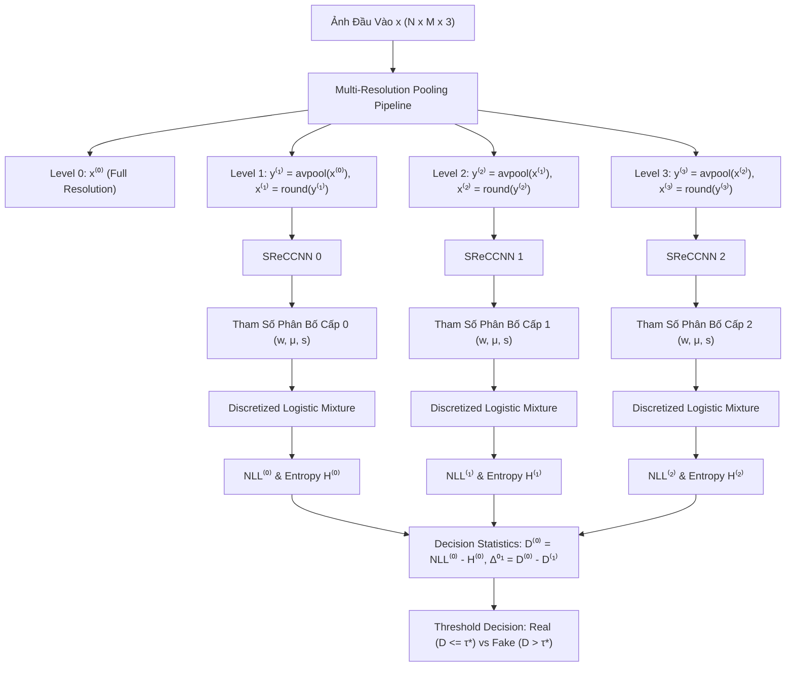

# 📄 Tài Liệu Kiến Trúc & Thuật Toán Mô Hình ZED Tiêu Chuẩn (Standard ZED)
> **Mô hình Phát hiện Ảnh AI Zero-Shot Gốc (Paper: "Zero-Shot Detection of AI-Generated Images" - Cozzolino et al.)**

---

## 📑 Mục Lục
1. [Tổng Quan & Ý Tưởng Cốt Lõi](#1-tổng-quan--ý-tưởng-cốt-lõi)
2. [Sơ Đồ Kiến Trúc Hệ Thống (System Architecture)](#2-sơ-đồ-kiến-trúc-hệ-thống-system-architecture)
3. [Cơ Sở Toán Học & Công Thức Chính](#3-cơ-sở-toán-học--công-thức-chính)
   - [3.1. Kim Tự Tháp Đa Độ Phân Giải (Multi-Resolution Pyramid)](#31-kim-tự-tháp-đa-độ-phân-giải-multi-resolution-pyramid)
   - [3.2. Mạng CNN Siêu Độ Phân Giải (SReCCNN Encoder)](#32-mạng-cnn-siêu-độ-phân-giải-sreccnn-encoder)
   - [3.3. Hỗn Hợp Phân Bố Logistic Rời Rạc (Discretized Logistic Mixture)](#33-hỗn-hợp-phân-bố-logistic-rời-rạc-discretized-logistic-mixture)
   - [3.4. Tính Toán NLL và Expected Entropy ($H$)](#34-tính-toán-nll-và-expected-entropy-h)
   - [3.5. Trích Xuất Chỉ Số Quyết Định Zero-Shot ($D^{(0)}, \Delta^{01}$)](#35-trích-xuất-chỉ-số-quyết-định-zero-shot-d0-\delta01)
4. [Luồng Huấn Luyện (Training Pipeline - Real Images Only)](#4-luồng-huấn-luyện-training-pipeline---real-images-only)
5. [Luồng Suy Luận & Phân Loại Zero-Shot (Inference Workflow)](#5-luồng-suy-luận--phân-loại-zero-shot-inference-workflow)

---

## 1. 🎯 Tổng Quan & Ý Tưởng Cốt Lõi

Mô hình **ZED (Zero-shot Entropy-based Detector)** giải quyết bài toán phát hiện ảnh AI mà **không cần sử dụng bất kỳ ảnh giả/AI nào trong quá trình huấn luyện**.

### Nguyên lý hoạt động:
1. **Chỉ học trên ảnh thật (Real Images):** Sử dụng bộ nén không mất thông tin SReC (Super-resolution based Lossless Compressor) để học phân bố xác suất nội tại của ảnh tự nhiên.
2. **Đo độ "Bất Ngờ" (Surprise Measurement):** Khi đưa một bức ảnh vào mô hình:
   - **Ảnh Thật (Real):** Chi phí mã hóa thực tế ($\text{NLL}$) tương đồng với độ hỗn loạn kỳ vọng dự đoán ($H$). Khoảng hẫng $D = \text{NLL} - H \approx 0$.
   - **Ảnh AI (Fake):** Mô hình bị "bất ngờ" bởi phân bố bất thường của pixel do mô hình sinh tạo ra, khiến chi phí nén thực tế tăng cao hơn nhiều so với dự đoán ($D > 0$).

---

## 2. 🏗️ Sơ Đồ Kiến Trúc Hệ Thống (System Architecture)

---

## 3. 📐 Cơ Sở Toán Học & Công Thức Chính

### 3.1. Kim Tự Tháp Đa Độ Phân Giải (Multi-Resolution Pyramid)
Cho ảnh đầu vào $x \in \{0, \dots, 255\}^{N \times M \times 3}$:
- **Cấp 0 (Full Resolution):** $x^{(0)} = x$
- **Cấp 1 (Subsampled 2x):** $y^{(1)} = \text{avpool}(x^{(0)}), \quad x^{(1)} = \text{round}(y^{(1)})$
- **Cấp 2 (Subsampled 4x):** $y^{(2)} = \text{avpool}(x^{(1)}), \quad x^{(2)} = \text{round}(y^{(2)})$
- **Cấp 3 (Subsampled 8x):** $y^{(3)} = \text{avpool}(x^{(2)}), \quad x^{(3)} = \text{round}(y^{(3)})$

---

### 3.2. Mạng CNN Siêu Độ Phân Giải (SReCCNN Encoder)
Với mỗi cấp độ phân giải $l \in \{0, 1, 2\}$, mạng $\text{CNN}_l$ nhận ngữ cảnh độ phân giải thấp $y^{(l+1)}$ (đã được bilinear upsample về cùng kích thước với $x^{(l)}$) để dự đoán tham số phân bố xác suất cho từng pixel:

$$\text{Params}^{(l)} = \text{SReCCNN}_l\left(\text{Upsample}(y^{(l+1)})\right) \in \mathbb{R}^{B \times [K \cdot (1 + 2C)] \times H_l \times W_l}$$

Với $C=3$ kênh màu và $K=10$ thành phần hỗn hợp, số kênh đầu ra là:
$$\text{Out Channels} = 10 \times (1 + 2 \times 3) = 70 \text{ channels}$$

---

### 3.3. Hỗn Hợp Phân Bố Logistic Rời Rạc (Discretized Logistic Mixture)
Phân bố xác suất mật độ của một giá trị pixel $x \in \{0, \dots, 255\}$ được tính bằng hỗn hợp $K=10$ phân bố Logistic rời rạc:

$$P(x \mid X) = \sum_{k=1}^{K} w_k \cdot \text{logistic}(x \mid \mu_k, s_k)$$

Trong đó:
- Trọng số hỗn hợp: $w_k = \frac{e^{a_k}}{\sum_{j=1}^K e^{a_j}}$ (với $a_k$ là weight logits).
- Hàm mật độ rời rạc (Discrete PMF):
  $$\text{logistic}(x \mid \mu, s) = \sigma\left(\frac{x - \mu + 0.5}{s}\right) - \sigma\left(\frac{x - \mu - 0.5}{s}\right)$$
- Xử lý biên cho giá trị discrete 8-bit:
  $$\begin{cases}
  x = 0 &\Rightarrow P(x) = \sigma\left(\frac{0.5 - \mu}{s}\right) \\
  x = 255 &\Rightarrow P(x) = 1 - \sigma\left(\frac{254.5 - \mu}{s}\right) \\
  0 < x < 255 &\Rightarrow P(x) = \sigma\left(\frac{x - \mu + 0.5}{s}\right) - \sigma\left(\frac{x - \mu - 0.5}{s}\right)
  \end{cases}$$

---

### 3.4. Tính Toán NLL và Expected Entropy ($H$)

1. **Chi phí mã hóa thực tế (Negative Log-Likelihood - NLL):**
   $$\text{NLL}_{i,j}^{(l)} = -\log_2 P(x_{i,j}^{(l)} \mid X_{i,j}^{(l)}) \quad (\text{bits/pixel})$$

2. **Độ hỗn loạn kỳ vọng (Expected Entropy - H):**
   $$H_{i,j}^{(l)} = -\sum_{v=0}^{255} P(v \mid X_{i,j}^{(l)}) \log_2 P(v \mid X_{i,j}^{(l)})$$

3. **Trung bình không gian (Spatial Average):**
   $$\text{NLL}^{(l)} = \frac{1}{H \cdot W} \sum_{i=1}^H \sum_{j=1}^W \text{NLL}_{i,j}^{(l)}, \quad H^{(l)} = \frac{1}{H \cdot W} \sum_{i=1}^H \sum_{j=1}^W H_{i,j}^{(l)}$$

---

### 3.5. Trích Xuất Chỉ Số Quyết Định Zero-Shot ($D^{(0)}, \Delta^{01}$)

Định nghĩa khoảng hẫng chi phí mã hóa (Coding Cost Gap) ở mỗi cấp $l$:
$$D^{(l)} = \text{NLL}^{(l)} - H^{(l)}$$

- **Đặc trưng quyết định cấp 0:** $D^{(0)} = \text{NLL}^{(0)} - H^{(0)}$ và $|D^{(0)}|$
- **Độ dốc chênh lệch giữa các cấp (Resolution Slope):**
  $$\Delta^{01} = D^{(0)} - D^{(1)}$$

**Quy tắc ra quyết định phân loại:**
$$\text{Prediction} = \begin{cases}
\text{Fake (AI-Generated)} & \text{nếu } D^{(0)} > \tau^* \text{ hoặc } |\Delta^{01}| > \tau_{\Delta}^* \\
\text{Real Image} & \text{ngược lại}
\end{cases}$$

---

## 4. 🔄 Luồng Huấn Luyện (Training Pipeline - Real Images Only)

Mô hình **chỉ được huấn luyện trên tập ảnh thật (Real Images)**. 

### Hàm Mất Mát (Loss Function):
$$\mathcal{L} = \text{NLL}^{(0)} + \text{NLL}^{(1)} + \text{NLL}^{(2)}$$

### Quy trình huấn luyện (`zed/train.py`):
1. Nạp tập ảnh thật $x \in \mathbb{R}^{B \times C \times H \times W}$.
2. Xây dựng kim tự tháp $x^{(0)}, x^{(1)}, x^{(2)}, x^{(3)}$ và $y^{(1)}, y^{(2)}, y^{(3)}$.
3. Tính toán $\text{NLL}^{(l)}$ cho từng cấp $l \in \{0, 1, 2\}$.
4. Tối ưu hóa trọng số mô hình bằng thuật toán **AdamW** với **Cosine Annealing Learning Rate Scheduler**.
5. Sử dụng **Automatic Mixed Precision (`torch.amp`)** để tăng tốc độ huấn luyện.

---

## 5. ⚡ Luồng Suy Luận & Phân Loại Zero-Shot (Inference Workflow)

1. Nạp ảnh thử nghiệm $x$ (Real hoặc Fake).
2. Chạy qua `ZEDModel` ở chế độ suy luận `compute_entropy=True`.
3. Tính toán toàn bộ $\text{NLL}^{(l)}$ và exact Expected Entropy $H^{(l)}$ trên 256 mức độ xám.
4. Trích xuất các chỉ số $D^{(0)}, |D^{(0)}|, |\Delta^{01}|$.
5. Tính điểm số **ROC-AUC (%)**, **Best Accuracy (%)** và **Threshold tối ưu ($\tau^*$)** trên tập kiểm thử.
