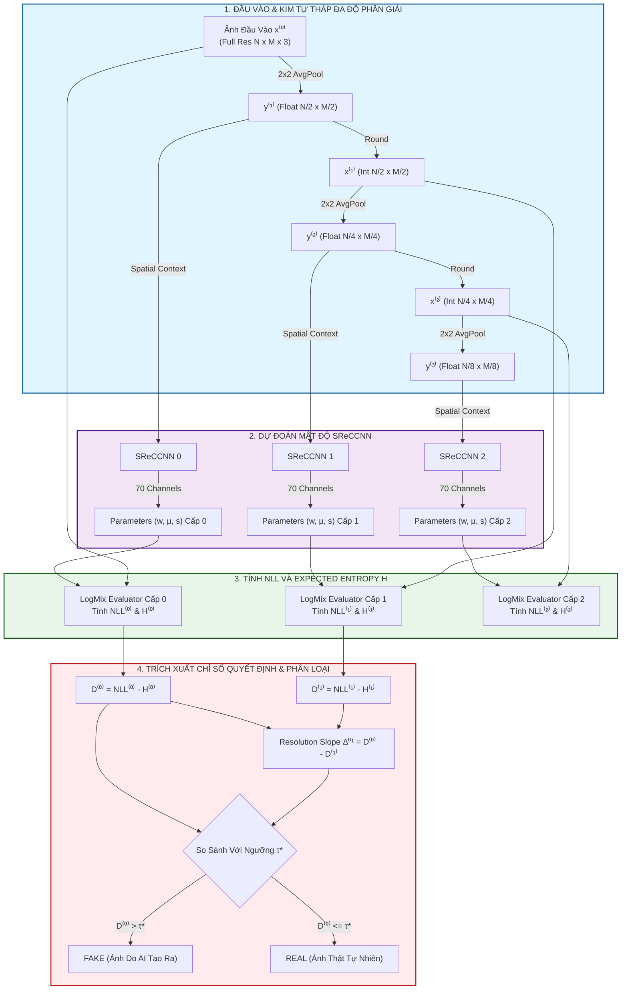

# 📄 Báo Cáo Chuyên Sâu: Kiến Trúc & Thuật Toán Mô Hình ZED Tiêu Chuẩn (Standard ZED)
> **Nghiên Cứu Phát Hiện Ảnh AI Theo Phương Pháp Zero-Shot Dựa Trên Lý Thuyết Thông Tin & Mô Hình Nén Mật Độ (Paper: "Zero-Shot Detection of AI-Generated Images" - Cozzolino et al.)**

---

## 📑 Mục Lục Báo Cáo
1. [Chương 1: Báo Cáo Tổng Quan Mô Hình ZED (Executive Overview)](#chương-1-báo-cáo-tổng-quan-mô-hình-zed-executive-overview)
   - [1.1. Bài toán phát hiện ảnh AI & Sự thất bại của Học có giám sát](#11-bài-toán-phát-hiện-ảnh-ai--sự-thất-bại-của-học-có-giám-sát)
   - [1.2. Hướng tiếp cận Zero-Shot của mô hình ZED](#12-hướng-tiếp-cận-zero-shot-của-mô-hình-zed)
   - [1.3. NLL và Expected Entropy ($H$) trong bài toán này là gì?](#13-nll-và-expected-entropy-h-trong-bài-toán-này-là-gì)
   - [1.4. Sơ đồ kiến trúc hệ thống tổng quan (System Architecture Diagram)](#14-sơ-đồ-kiến-trúc-hệ-thống-tổng-quan-system-architecture-diagram)
2. [Chương 2: Kim Tự Tháp Đa Độ Phân Giải (Multi-Resolution Pyramid Hierarchy)](#chương-2-kim-tự-tháp-đa-độ-phân-giải-multi-resolution-pyramid-hierarchy)
   - [2.1. Thuật toán Downsampling 2x2 Average Pooling & Rounding](#21-thuật-toán-downsampling-2x2-average-pooling--rounding)
   - [2.2. Vai trò của ma trận Float $y^{(l+1)}$ và ma trận Integer $x^{(l+1)}$](#22-vai-trò-của-ma-trận-float-yl1-và-ma-trận-integer-xl1)
3. [Chương 3: Mô Hình Mật Độ SReCCNN & Phân Bố Logistic Rời Rạc](#chương-3-mô-hình-mật-độ-sreccnn--phân-bố-logistic-rời-rạc)
   - [3.1. Kiến trúc mạng mật độ `SReCCNN`](#31-kiến-trúc-mạng-mật-độ-sreccnn)
   - [3.2. Công thức phân bố hỗn hợp Logistic rời rạc ($K=10$)](#32-công-thức-phân-bố-hỗn-hợp-logistic-rời-rạc-k10)
   - [3.3. Thuật toán xử lý biên 8-bit rời rạc & Log-Sum-Exp](#33-thuật-toán-xử-lý-biên-8-bit-rời-rạc--log-sum-exp)
4. [Chương 4: Nền Tảng Lý Thuyết Thông Tin Sâu & Chứng Minh Toán Học](#chương-4-nền-tảng-lý-thuyết-thông-tin-sâu--chứng-minh-toán-học)
   - [4.1. Chứng minh Tối thiểu hóa NLL chính là Cross-Entropy Loss](#41-chứng-minh-tối-thiểu-hóa-nll-chính-là-cross-entropy-loss)
   - [4.2. Chứng minh NLL ép phân bố mô hình $P_\theta$ trùng khít phân bố tự nhiên $p_{\text{data}}$](#42-chứng-minh-nll-ép-phân-bố-mô-hình-p_\theta-trùng-khít-phân-bố-tự-nhiên-p_{\text{data}})
   - [4.3. Trực quan hóa cơ chế triệt tiêu $D = \langle \text{NLL} \rangle - H(P_\theta) = 0$ qua bài toán xúc xắc](#43-trực-quan-hóa-cơ-chế-triệt-tiêu-d--\langle-\textnll-\rangle---hp_\theta--0-qua-bài-toán-xúc-xắc)
5. [Chương 5: Bảng Thuật Ngữ & Ánh Xạ Mã Nguồn PyTorch (`zed/models/`)](#chương-5-bảng-thuật-ngữ--ánh-xạ-mã-nguồn-pytorch-zedmodels)
6. [Chương 6: Quy Trình Huấn Luyện & Suy Luận Phân Loại Zero-Shot](#chương-6-quy-trình-huấn-luyện--suy-luận-phân-loại-zero-shot)

---

## Chương 1: Báo Cáo Tổng Quan Mô Hình ZED (Executive Overview)

### 1.1. Bài toán phát hiện ảnh AI & Sự thất bại của Học có giám sát

Trong những năm gần đây, sự ra đời của các mô hình sinh ảnh bằng AI (DALL-E 3, Midjourney v5, Stable Diffusion XL, StyleGAN3, DiT) đã tạo ra các hình ảnh giả có độ chân thực tới mức mắt thường không thể phân biệt. Điều này đặt ra nguy cơ lớn về lừa đảo, giả mạo truyền thông và sai lệch thông tin.

Để đối phó, các phương pháp phát hiện truyền thống thường dùng **Học có giám sát (Supervised Learning)**:
- Người ta gom tập dữ liệu gồm cả Ảnh Thật (Real) và Ảnh AI (Fake) từ một số mô hình sinh (ví dụ: ProGAN, StyleGAN2) để huấn luyện một mạng phân loại nhị phân.
- **Hạn chế chí mạng:** Mô hình có giám sát bị **học tủ (overfitting)** vào các lỗi vi mô cụ thể của mô hình AI trong tập train. Khi một mô hình sinh mới xuất hiện (ví dụ: Midjourney v5 hoặc SDXL), các bộ phát hiện có giám sát gần như bị vô hiệu hóa hoàn toàn (độ chính xác giảm từ >95% xuống <60%).

---

### 1.2. Hướng tiếp cận Zero-Shot của mô hình ZED

Mô hình **ZED (Zero-shot Entropy-based Detector)** thay đổi hoàn toàn tư duy:
- **KHÔNG sử dụng bất kỳ ảnh giả/AI nào trong quá trình huấn luyện.**
- **CHỈ học phân bố xác suất của Ảnh Thật ($p_{\text{data}}$)** thông qua mô hình nén mật độ không mất thông tin SReC (Super-resolution based Lossless Compressor).
- Nguyên lý: Khi mô hình đã học khép kín quy luật toán học của ảnh tự nhiên, nó có thể đánh giá bất kỳ bức ảnh mới nào mà không quan tâm bức ảnh đó do mô hình AI nào tạo ra $\implies$ **Khả năng tổng quát hóa Zero-Shot hoàn hảo**.

---

### 1.3. NLL và Expected Entropy ($H$) trong bài toán này là gì?

Để hiểu cách ZED đưa ra quyết định phân loại, ta cần định nghĩa rõ 3 khái niệm nền tảng:

#### A. Chi phí mã hóa thực tế (Negative Log-Likelihood - NLL):
- **Bản chất:** NLL đo đạc **chi phí dung lượng lưu trữ thực tế** (tính bằng bits/pixel) mà bộ nén SReC phải tốn để lưu bức ảnh kiểm thử.
- **Ý nghĩa vật lý:** NLL đại diện cho **Độ Bất Ngờ (Surprise Level)** của mô hình. Nếu một bức ảnh có cấu trúc pixel xa lạ với quy luật ảnh thật, mô hình sẽ bị "bất ngờ", dán nhãn xác suất thấp cho các điểm ảnh đó, làm cho NLL tăng vọt.

$$
\text{NLL}_{i,j}^{(l)} = -\log_2 P_\theta\left(x_{i,j}^{(l)} \mid X_{i,j}^{(l)}\right)
$$

#### B. Độ hỗn loạn kỳ vọng (Expected Entropy - $H$):
- **Bản chất:** Expected Entropy $H$ đại diện cho **dung lượng lưu trữ trung bình lý thuyết kỳ vọng** mà mô hình tự tính trước, dựa trên đường cong phân bố xác suất mà nó đã học từ dữ liệu ảnh thật.

$$
H_{i,j}^{(l)} = -\sum_{v=0}^{255} P_\theta\left(v \mid X_{i,j}^{(l)}\right) \log_2 P_\theta\left(v \mid X_{i,j}^{(l)}\right)
$$

#### C. Khoảng hẫng chi phí mã hóa (Coding Cost Gap - $D$):
- **Hiệu số quyết định:** $D = \text{NLL} - H$.
  - **Với Ảnh Thật (Real Image):** Do bức ảnh tuân theo đúng quy luật tự nhiên mô hình đã học, chi phí mã hóa thực tế sẽ bằng đúng chi phí dự đoán lý thuyết $\implies \langle \text{NLL} \rangle \approx H \implies D \approx 0$.
  - **Với Ảnh AI (Synthetic Image):** Do bức ảnh chứa các bất thường vi mô không có trong tự nhiên, chi phí mã hóa thực tế sẽ cao hơn hẳn chi phí dự đoán $\implies \langle \text{NLL} \rangle > H \implies D > 0$.

---

### 1.4. Sơ đồ kiến trúc hệ thống tổng quan (System Architecture Diagram)

Dưới đây là sơ đồ tổng quan thể hiện trọn vẹn luồng dữ liệu từ bức ảnh đầu vào $x$ cho đến khi đưa ra kết quả phân loại:

---

## Chương 2: Kim Tự Tháp Đa Độ Phân Giải (Multi-Resolution Pyramid Hierarchy)

### 2.1. Thuật toán Downsampling 2x2 Average Pooling & Rounding

Để nén và phân tích ảnh hiệu quả, ZED xây dựng một kim tự tháp đa độ phân giải gồm 4 cấp $l \in \{0, 1, 2, 3\}$:

1. **Cấp 0 (Full Resolution):** $x^{(0)} = x \in \{0, \dots, 255\}^{N \times M \times 3}$.
2. **Cấp 1 (Subsampled 2x):** 
   $$y_{i,j}^{(1)} = \frac{x_{2i, 2j}^{(0)} + x_{2i+1, 2j}^{(0)} + x_{2i, 2j+1}^{(0)} + x_{2i+1, 2j+1}^{(0)}}{4} \in \mathbb{R}$$
   $$x^{(1)} = \text{round}\left(y^{(1)}\right) \in \{0, \dots, 255\}$$
3. **Cấp 2 (Subsampled 4x):** 
   $$y_{i,j}^{(2)} = \text{avpool}(x^{(1)}), \qquad x^{(2)} = \text{round}\left(y^{(2)}\right)$$
4. **Cấp 3 (Subsampled 8x):** 
   $$y^{(3)} = \text{avpool}(x^{(2)}), \qquad x^{(3)} = \text{round}\left(y^{(3)}\right)$$

---

### 2.2. Vai trò của ma trận Float $y^{(l+1)}$ và ma trận Integer $x^{(l+1)}$

Trong quá trình nén và dự đoán:
- **Ma trận $y^{(l+1)}$ (Float):** Giữ nguyên giá trị số thực liên tục chưa làm tròn để giữ lại tối đa thông tin ngữ cảnh mịn (sub-pixel details), làm đầu vào điều kiện cho mạng $\text{SReCCNN}_l$.
- **Ma trận $x^{(l+1)}$ (Integer 8-bit):** Đóng vai trò là bức ảnh rời rạc mục tiêu ở cấp $l+1$ để tính toán $\text{NLL}^{(l+1)}$ và $H^{(l+1)}$.

---

## Chương 3: Mô Hình Mật Độ SReCCNN & Phân Bố Logistic Rời Rạc

### 3.1. Kiến trúc mạng mật độ `SReCCNN`

Với mỗi cấp độ phân giải $l \in \{0, 1, 2\}$, một mạng CNN riêng biệt ($\text{SReCCNN}_l$) nhận ngữ cảnh $y^{(l+1)}$ (đã được upsample về kích thước $(H_l, W_l)$) để dự đoán tham số phân bố xác suất cho từng pixel:

$$
\text{Params}^{(l)} = \text{SReCCNN}_l\left(\text{Upsample}(y^{(l+1)})\right) \in \mathbb{R}^{B \times [K \cdot (1 + 2C)] \times H_l \times W_l}
$$

Với $C=3$ kênh màu và $K=10$ thành phần hỗn hợp, tổng số kênh đầu ra dự đoán là:
$$\text{Out Channels} = 10 \times (1 + 2 \times 3) = 70 \text{ channels}$$

---

### 3.2. Công thức phân bố hỗn hợp Logistic rời rạc ($K=10$)

Mật độ xác suất của một điểm ảnh $x \in \{0, \dots, 255\}$ được biểu diễn bằng hỗn hợp $K=10$ phân bố Logistic:

$$
P_\theta(x \mid X) = \sum_{k=1}^{K} w_k \cdot \text{logistic}(x \mid \mu_k, s_k)
$$

Trong đó:
- $w_k = \text{softmax}(a_k) = \frac{e^{a_k}}{\sum_{j=1}^K e^{a_j}}$ là trọng số của phân bố thứ $k$.
- $\mu_k \in \mathbb{R}$ là trung vị/kỳ vọng vị trí điểm ảnh.
- $s_k > 0$ là độ rộng tỷ lệ (Scale Parameter).
- Hàm mật độ rời rạc PMF:

$$
\text{logistic}(x \mid \mu, s) = \sigma\left(\frac{x - \mu + 0.5}{s}\right) - \sigma\left(\frac{x - \mu - 0.5}{s}\right)
$$

---

### 3.3. Thuật toán xử lý biên 8-bit rời rạc & Log-Sum-Exp

Do giá trị điểm ảnh bị giới hạn trong khoảng 8-bit $\{0, 1, \dots, 255\}$, xác suất tại hai biên được tính bằng tích lũy CDF:

$$
P_\theta(x) = \begin{cases}
\sigma\left(\frac{0.5 - \mu}{s}\right), & \text{if } x = 0 \\
1 - \sigma\left(\frac{254.5 - \mu}{s}\right), & \text{if } x = 255 \\
\sigma\left(\frac{x - \mu + 0.5}{s}\right) - \sigma\left(\frac{x - \mu - 0.5}{s}\right), & \text{if } 0 < x < 255
\end{cases}
$$

Để tránh tràn số học (Numerical Underflow) khi $P(x)$ rất nhỏ, trong PyTorch ta tính trực tiếp trên không gian Log bằng kỹ thuật **Log-Sum-Exp**:

$$
\log P_\theta(x) = \text{LogSumExp}_{k=1}^K \left( \log w_k + \sum_{c=1}^C \log P_k(x_c) \right)
$$

---

## Chương 4: Nền Tảng Lý Thuyết Thông Tin Sâu & Chứng Minh Toán Học

### 4.1. Chứng minh Tối thiểu hóa NLL chính là Cross-Entropy Loss

Xét một điểm ảnh thực tế có giá trị đúng là $x_{\text{true}} \in \{0, \dots, 255\}$.

* **Theo góc nhìn Phân loại (Cross-Entropy):**
Nhãn thực tế của điểm ảnh được biểu diễn dưới dạng vector xác suất one-hot $y = [y_0, y_1, \dots, y_{255}]$, trong đó $y_k = 1$ nếu $k = x_{\text{true}}$, và $y_k = 0$ với mọi $k \neq x_{\text{true}}$.
Công thức Cross-Entropy giữa nhãn thực $y$ và phân phối dự đoán $P_\theta$ là:

$$
\text{Cross-Entropy}(y, P_\theta) = -\sum_{k=0}^{255} y_k \log_2 P_\theta(x = k \mid X)
$$

Vì $y_k$ chỉ bằng $1$ tại đúng vị trí $x_{\text{true}}$ và bằng $0$ ở 255 vị trí còn lại, toàn bộ tổng trên chỉ còn lại duy nhất một số hạng:

$$
\text{Cross-Entropy}(y, P_\theta) = -\log_2 P_\theta(x = x_{\text{true}} \mid X)
$$

* **Theo góc nhìn Xác suất (Negative Log-Likelihood - NLL):**
Chi phí âm log-xác suất gán cho giá trị thực tế chính là:

$$
\text{NLL} = -\log_2 P_\theta(x = x_{\text{true}} \mid X)
$$

Hai khái niệm này là **một biểu thức toán học duy nhất** được gọi bằng hai tên khác nhau tùy theo góc nhìn của kỹ sư học máy hay nhà lý thuyết thống kê.

---

### 4.2. Chứng minh NLL ép phân bố mô hình $P_\theta$ trùng khít phân bố tự nhiên $p_{\text{data}}$

Giả sử phân phối xác suất thống kê tự nhiên của ảnh thật ngoài đời là $p_{\text{data}}(x)$ (đây là quy luật khách quan của tự nhiên), và phân phối do mạng nơ-ron dự đoán là $P_\theta(x)$.

Khi ta huấn luyện mô hình trên tập dữ liệu ảnh thật $\mathcal{D}_{\text{real}}$, hàm mất mát trung bình trên toàn bộ dữ liệu chính là **Kỳ vọng của Cross-Entropy dưới phân phối dữ liệu thật**:

$$
\mathcal{L}(\theta) = \mathbb{E}_{x \sim p_{\text{data}}} [-\log_2 P_\theta(x \mid X)] = H(p_{\text{data}}, P_\theta)
$$

Áp dụng mối liên hệ giữa Cross-Entropy ($H$) và Phân kỳ Kullback-Leibler ($D_{\text{KL}}$):

$$
H(p_{\text{data}}, P_\theta) = H(p_{\text{data}}) + D_{\text{KL}}(p_{\text{data}} \parallel P_\theta)
$$

Trong đó:
- $H(p_{\text{data}}) = -\sum p_{\text{data}}(x) \log_2 p_{\text{data}}(x)$ là **Entropy nội tại của ảnh thật trong tự nhiên**. Đây là một **hằng số cố định**, hoàn toàn không phụ thuộc vào trọng số mạng $\theta$.
- $D_{\text{KL}}(p_{\text{data}} \parallel P_\theta) \ge 0$ là khoảng cách đo sự sai lệch giữa phân phối mô hình học được và phân phối tự nhiên.

Khi thực hiện thuật toán Gradient Descent để tìm $\theta$ sao cho hàm loss $\mathcal{L}(\theta)$ đạt giá trị nhỏ nhất:

$$
\arg\min_\theta \mathcal{L}(\theta) \iff \arg\min_\theta \left[ H(p_{\text{data}}) + D_{\text{KL}}(p_{\text{data}} \parallel P_\theta) \right] \iff \arg\min_\theta D_{\text{KL}}(p_{\text{data}} \parallel P_\theta)
$$

Theo **bất đẳng thức Gibbs**, $D_{\text{KL}}(p_{\text{data}} \parallel P_\theta)$ đạt giá trị cực tiểu bằng $0$ khi và chỉ khi:

$$
P_\theta(x \mid X) = p_{\text{data}}(x \mid X) \quad \text{hầu khắp nơi}
$$

Mạng CNN buộc phải uốn nắn các tham số $\{w_k, \mu_k, s_k\}$ sao cho đường cong xác suất $P_\theta$ trùng khít với quy luật phân bổ điểm ảnh thực tế của thế giới tự nhiên để đạt điểm loss thấp nhất.

---

### 4.3. Trực quan hóa cơ chế triệt tiêu $D = \langle \text{NLL} \rangle - H(P_\theta) = 0$ qua bài toán xúc xắc

* **Bài toán gieo xúc xắc lệch:** Giả sử tự nhiên gieo một con xúc xắc bị lệch với xác suất ra mặt 6 là $80\%$, các mặt còn lại (1 đến 5) mỗi mặt $4\%$.
* **Nếu mô hình đoán bừa (đều $16.6\%$):** Chi phí $\text{NLL}$ trung bình sẽ rất cao vì mô hình liên tục "bất ngờ" khi mặt 6 xuất hiện dồn dập.
* **Sau khi tối ưu hàm loss NLL:** Mô hình bị ép phải chỉnh phân phối dự đoán về đúng tỷ lệ $[4\%, 4\%, 4\%, 4\%, 4\%, 80\%]$.
* **Khi đã khớp hoàn hảo:**
  - Chi phí kỳ vọng mô hình tính trước (Entropy): 
    $$H(P_\theta) = -\sum_{k=1}^6 P(k) \log_2 P(k)$$
  - Chi phí thực tế quan sát qua hàng triệu lần gieo xúc xắc thật: 
    $$\langle \text{NLL} \rangle = \frac{1}{M} \sum_{i=1}^M -\log_2 P(x_{\text{thực}})$$
  - Theo **Luật số lớn (Law of Large Numbers)**, $\langle \text{NLL} \rangle$ sẽ bằng chính xác $H(P_\theta)$, dẫn đến hiệu số:

$$
D = \langle \text{NLL} \rangle - H(P_\theta) = 0 \quad (\text{đối với Ảnh Thật})
$$

* **Khi đưa Ảnh AI vào:** Ảnh AI được tạo ra từ phân phối $p_{\text{fake}} \neq p_{\text{data}}$. Do mô hình $P_\theta$ đã được "khóa cứng" theo ảnh thật, nó sẽ bị bất ngờ bởi các pixel bất thường của AI $\implies \langle \text{NLL} \rangle > H(P_\theta) \implies D > 0$.

---

## Chương 5: Bảng Thuật Ngữ & Ánh Xạ Mã Nguồn PyTorch (`zed/models/`)

| Ký hiệu toán học | Ý nghĩa vật lý / Thuật ngữ | File mã nguồn PyTorch | Lớp / Hàm tương ứng | Cấu trúc Tensor |
| :--- | :--- | :--- | :--- | :--- |
| $x^{(0)}$ | Ảnh gốc đầu vào | `zed/dataset.py` | `RealImageDataset.__getitem__` | `(B, 3, H, W)` |
| $y^{(l+1)}, x^{(l+1)}$ | Downsampling Pyramid | `zed/models/zed_model.py` | `ZEDModel.build_pyramid()` | `F.avg_pool2d`, `torch.round` |
| $\text{SReCCNN}_l$ | Mạng dự đoán mật độ | `zed/models/cnn_encoder.py` | `SReCCNN.forward()` | Input: `(B, 3, H, W)` $\to$ Out: `(B, 70, H, W)` |
| $w_k, \mu_k, s_k$ | 70 tham số Logistic | `zed/models/logistic_mixture.py` | `DiscretizedLogisticMixture.parse_params()` | `logit_weights` `(B,10,H,W)`, `means` `(B,10,3,H,W)` |
| $\text{NLL}_{i,j}^{(l)}$ | Negative Log-Likelihood | `zed/models/logistic_mixture.py` | `compute_nll_and_entropy()` | `-log_px / ln(2)` $\to$ `(B, H, W)` |
| $H_{i,j}^{(l)}$ | Expected Entropy | `zed/models/logistic_mixture.py` | `_compute_entropy_exact()` | Loops $v \in [0, 255]$ in chunks of 32 |
| $D^{(0)}, \Delta^{01}$ | Decision Statistics | `zed/models/zed_model.py` | `ZEDModel.forward()` | `d0 = nll[0] - h[0]`, `delta01 = d0 - d1` |

---

## Chương 6: Quy Trình Huấn Luyện & Suy Luận Phân Loại Zero-Shot

### 6.1. Quy trình Huấn luyện (Training Pipeline - Real Images Only)
1. **Dữ liệu:** Chỉ nạp tập ảnh thật trong `data/real_images`.
2. **Hàm Mất Mát:**
   $$\mathcal{L} = \text{NLL}^{(0)} + \text{NLL}^{(1)} + \text{NLL}^{(2)}$$
3. **Tối Ưu Hóa:** AdamW Optimizer + Cosine Annealing LR Scheduler + Automatic Mixed Precision (`torch.amp`).

### 6.2. Quy trình Suy luận & Phân loại Zero-Shot (Inference)
1. Nạp ảnh test (Real & Fake).
2. Chạy forward `model(images, compute_entropy=True)` để trích xuất $\text{NLL}^{(l)}$ và exact Expected Entropy $H^{(l)}$.
3. Trích xuất chỉ số $D^{(0)} = \text{NLL}^{(0)} - H^{(0)}$ và $|\Delta^{01}|$.
4. Đánh giá chỉ số ROC-AUC (%), Best Accuracy (%) và tìm ngưỡng quyết định tối ưu $\tau^*$ bằng hàm `compute_metrics()`.
