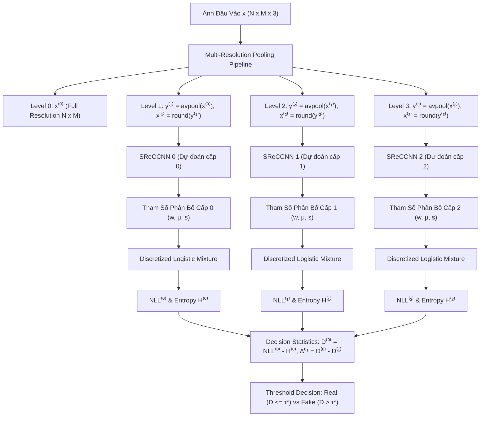

# 📄 Tài Liệu Kiến Trúc & Thuật Toán Mô Hình ZED Tiêu Chuẩn (Standard ZED)
> **Mô hình Phát hiện Ảnh AI Zero-Shot Gốc (Paper: "Zero-Shot Detection of AI-Generated Images" - Cozzolino et al.)**

---

## 📑 Mục Lục
1. [Tổng Quan & Ý Tưởng Cốt Lõi](#1-tổng-quan--ý-tưởng-cốt-lõi)
2. [Bảng Thuật Ngữ & Giải Thích Chi Tiết Ký Hiệu Toán Học](#2-bảng-thuật-ngữ--giải-thích-chi-tiết-ký-hiệu-toán-học)
3. [Sơ Đồ Kiến Trúc Hệ Thống (System Architecture)](#3-sơ-đồ-kiến-trúc-hệ-thống-system-architecture)
4. [Cơ Sở Toán Học & Công Thức Chi Tiết](#4-cơ-sở-toán-học--công-thức-chi-tiết)
   - [4.1. Kim Tự Tháp Đa Độ Phân Giải (Multi-Resolution Pyramid)](#41-kim-tự-tháp-đa-độ-phân-giải-multi-resolution-pyramid)
   - [4.2. Mạng CNN Siêu Độ Phân Giải (SReCCNN Encoder)](#42-mạng-cnn-siêu-độ-phân-giải-sreccnn-encoder)
   - [4.3. Hỗn Hợp Phân Bố Logistic Rời Rạc (Discretized Logistic Mixture)](#43-hỗn-hợp-phân-bố-logistic-rời-rạc-discretized-logistic-mixture)
   - [4.4. Tính Toán NLL và Expected Entropy ($H$)](#44-tính-toán-nll-và-expected-entropy-h)
   - [4.5. Trích Xuất Chỉ Số Quyết Định Zero-Shot ($D^{(0)}, \Delta^{01}$)](#45-trích-xuất-chỉ-số-quyết-định-zero-shot-d0-\delta01)
5. [Luồng Huấn Luyện (Training Pipeline - Real Images Only)](#5-luồng-huấn-luyện-training-pipeline---real-images-only)
6. [Luồng Suy Luận & Phân Loại Zero-Shot (Inference Workflow)](#6-luồng-suy-luận--phân-loại-zero-shot-inference-workflow)

---

## 1. 🎯 Tổng Quan & Ý Tưởng Cốt Lõi

Mô hình **ZED (Zero-shot Entropy-based Detector)** giải quyết bài toán phát hiện ảnh AI mà **không cần sử dụng bất kỳ ảnh giả/AI nào trong quá trình huấn luyện**.

### Nguyên lý hoạt động:
1. **Chỉ học trên ảnh thật (Real Images):** Sử dụng bộ nén không mất thông tin SReC (Super-resolution based Lossless Compressor) để học phân bố xác suất nội tại của ảnh tự nhiên.
2. **Đo độ "Bất Ngờ" (Surprise Measurement):** Khi đưa một bức ảnh vào mô hình:
   - **Ảnh Thật (Real):** Chi phí mã hóa thực tế ($\text{NLL}$) tương đồng với độ hỗn loạn kỳ vọng dự đoán ($H$). Khoảng hẫng $D = \text{NLL} - H \approx 0$.
   - **Ảnh AI (Fake):** Mô hình bị "bất ngờ" bởi phân bố bất thường của pixel do mô hình sinh tạo ra, khiến chi phí nén thực tế tăng cao hơn nhiều so với dự đoán ($D > 0$).

---

## 2. 🔤 Bảng Thuật Ngữ & Giải Thích Chi Tiết Ký Hiệu Toán Học

Để đảm bảo tính chuẩn xác và rõ ràng tuyệt đối, bảng dưới đây giải thích chi tiết toàn bộ các biến số, ma trận và ký hiệu toán học xuất hiện trong mô hình ZED:

| Ký hiệu / Biến | Kiểu dữ liệu / Miền giá trị | Giải thích chi tiết & Ý nghĩa vật lý |
| :--- | :--- | :--- |
| **$x$** | $\mathbb{R}^{B \times C \times N \times M}$ | **Ảnh đầu vào gốc**: Ảnh RGB hoặc 8-bit grayscale cần kiểm thử/huấn luyện. Các giá trị pixel là số nguyên rời rạc $x_{i,j} \in \{0, 1, 2, \dots, 255\}$. |
| **$B$** | $\mathbb{Z}^+$ (Số nguyên dương) | **Kích thước Batch (Batch Size)**: Số lượng bức ảnh xử lý đồng thời trong 1 lần lan truyền tiến (Forward Pass). |
| **$C$** | $C = 3$ | **Số kênh màu (Channels)**: $C=3$ ứng với 3 kênh màu RGB (Red, Green, Blue). |
| **$N, M$ (hoặc $H, W$)** | $\mathbb{Z}^+$ (Pixel) | **Chiều cao (Height $N$) và Chiều rộng (Width $M$)** của ma trận ảnh tính theo số lượng điểm ảnh. |
| **$l \in \{0, 1, 2, 3\}$** | $\mathbb{Z}_{\ge 0}$ | **Chỉ số cấp độ phân giải (Resolution Scale Level)**: • $l=0$: Độ phân giải gốc đầy đủ ($N \times M$). • $l=1$: Độ phân giải giảm 2 lần ($N/2 \times M/2$). • $l=2$: Độ phân giải giảm 4 lần ($N/4 \times M/4$). • $l=3$: Độ phân giải giảm 8 lần ($N/8 \times M/8$), đóng vai trò là "prompt"/bối cảnh nền ban đầu cho cấp 2. |
| **$x^{(l)}$** | $\{0, \dots, 255\}^{C \times \frac{N}{2^l} \times \frac{M}{2^l}}$ | **Ma trận ảnh số nguyên rời rạc ở cấp $l$**: Phiên bản ảnh đã được làm tròn nguyên ở cấp độ phân giải $l$. Các pixel $x^{(l)}_{i,j} \in \{0, 1, \dots, 255\}$. |
| **$y^{(l+1)}$** | $\mathbb{R}^{C \times \frac{N}{2^{l+1}} \times \frac{M}{2^{l+1}}}$ | **Ma trận ảnh số thực liên tục (Unrounded float)**: Kết quả thu được sau khi thực hiện phép lấy giá trị trung bình không gian $2 \times 2$ (Average Pooling) từ $x^{(l)}$. Mối quan hệ: $y^{(l+1)} = \text{avpool}(x^{(l)})$, và $x^{(l+1)} = \text{round}(y^{(l+1)})$. |
| **$y_{i,j}^{(l+1)}$** | $\mathbb{R}$ | **Giá trị trung bình float** của khối $2 \times 2$ pixel ở cấp $l$: $y_{i,j}^{(1)} = \frac{x_{2i, 2j}^{(0)} + x_{2i+1, 2j}^{(0)} + x_{2i, 2j+1}^{(0)} + x_{2i+1, 2j+1}^{(0)}}{4}$. |
| **$Y_{i,j}^{(l+1)}$** | Ma trận đặc trưng không gian | **Ngữ cảnh không gian độ phân giải thấp**: Bối cảnh từ cấp $l+1$ dùng làm thông tin điều kiện cho mạng $\text{SReCCNN}_l$ để dự đoán phân bố ở cấp $l$. |
| **$X_{i,j}^{(l)}$** | Tập ngữ cảnh điều kiện | **Tập ngữ cảnh điều kiện đầy đủ tại vị trí $(i, j)$** ở cấp $l$ (gồm bối cảnh cấp thấp $Y_{i,j}^{(l+1)}$ và các pixel cùng cấp $l$ đã được nén trước đó). |
| **$K$** | $K = 10$ | **Số lượng thành phần hỗn hợp (Mixture Components)**: Số phân bố Logistic độc lập kết hợp với nhau để mô hình hóa mật độ phức tạp của pixel. |
| **$k \in \{1, \dots, K\}$** | $\mathbb{Z}^+$ | **Chỉ số của phân bố thành phần thứ $k$** trong mô hình hỗn hợp. |
| **$w_k$ (hoặc $\pi_k$)** | $w_k \in (0, 1), \sum w_k = 1$ | **Trọng số hỗn hợp (Mixture Weights)**: Mức độ đóng góp của phân bố thứ $k$. Được tính bằng hàm Softmax từ logits $a_k$: $w_k = \frac{e^{a_k}}{\sum_{j=1}^K e^{a_j}}$. |
| **$a_k$** | $\mathbb{R}$ | **Logits trọng số** dự đoán bởi mạng CNN cho thành phần thứ $k$. |
| **$\mu_k$** | $\mathbb{R}$ | **Giá trị kỳ vọng/Trung vị (Location/Mean Parameter)** của phân bố Logistic thứ $k$ tại điểm ảnh. |
| **$s_k$** | $\mathbb{R}^+$ ($s_k > 0$) | **Độ rộng/Tỷ lệ (Scale Parameter)** của phân bố Logistic thứ $k$. Trong code, dự đoán dưới dạng $\log s_k$ và bị chặn dưới bởi `min_log_scale = -7.0` để chống bùng nổ số học. |
| **$\sigma(z)$** | $\sigma(z) = \frac{1}{1 + e^{-z}}$ | **Hàm Sigmoid**: Chuyển đổi các khoảng phân bố liên tục về xác suất tích lũy CDF của Logistic. |
| **$P(x_{i,j}^{(l)} \mid X_{i,j}^{(l)})$** | $P \in [0, 1]$ | **Xác suất điều kiện rời rạc** của pixel $x_{i,j}^{(l)}$ cho bởi mô hình nén SReC. |
| **$v \in \{0, 1, \dots, 255\}$** | $\mathbb{Z}_{\ge 0}$ | **Biến quét 256 mức giá trị cường độ xám/màu**: Dùng để tính tổng chính xác độ hỗn loạn kỳ vọng $H$. |
| **$\text{NLL}_{i,j}^{(l)}$** | $\mathbb{R}^+$ (bits/pixel) | **Negative Log-Likelihood tại pixel $(i, j)$ ở cấp $l$**: Chi phí mã hóa thực tế để lưu trữ pixel đó tính theo bits. |
| **$H_{i,j}^{(l)}$** | $\mathbb{R}^+$ (bits/pixel) | **Expected Entropy tại pixel $(i, j)$ ở cấp $l$**: Độ hỗn loạn/chi phí mã hóa trung bình lý thuyết kỳ vọng từ mô hình. |
| **$\text{NLL}^{(l)}$** | $\mathbb{R}^+$ (bits/pixel) | **Trung bình NLL không gian của toàn bức ảnh** ở cấp độ phân giải $l$: $\text{NLL}^{(l)} = \frac{1}{HW} \sum_{i,j} \text{NLL}_{i,j}^{(l)}$. |
| **$H^{(l)}$** | $\mathbb{R}^+$ (bits/pixel) | **Trung bình Entropy không gian của toàn bức ảnh** ở cấp độ phân giải $l$: $H^{(l)} = \frac{1}{HW} \sum_{i,j} H_{i,j}^{(l)}$. |
| **$D^{(l)}$** | $\mathbb{R}$ (bits/pixel) | **Khoảng hẫng chi phí mã hóa (Coding Cost Gap)** ở cấp $l$: $D^{(l)} = \text{NLL}^{(l)} - H^{(l)}$. |
| **$D^{(0)}$** | $\mathbb{R}$ (bits/pixel) | **Đặc trưng thống kê quyết định cốt lõi (Core Decision Statistic)**: Khoảng hẫng $D$ tại độ phân giải gốc $l=0$. |
| **$\Delta^{01}$** | $\mathbb{R}$ (bits/pixel) | **Độ dốc khoảng hẫng chi phí mã hóa (Resolution Slope)**: $\Delta^{01} = D^{(0)} - D^{(1)}$. |
| **$\tau^*$** | $\mathbb{R}$ | **Ngưỡng quyết định tối ưu (Optimal Decision Threshold)**: Dùng so sánh với $D^{(0)}$ hoặc $|\Delta^{01}|$ để phân loại Ảnh Thật vs Ảnh AI. |

---

## 3. 🏗️ Sơ Đồ Kiến Trúc Hệ Thống (System Architecture)

---

## 4. 📐 Cơ Sở Toán Học & Công Thức Chi Tiết

### 4.1. Kim Tự Tháp Đa Độ Phân Giải (Multi-Resolution Pyramid)
Cho ảnh đầu vào $x \in \{0, \dots, 255\}^{N \times M \times 3}$:
- **Cấp 0 (Full Resolution):** $x^{(0)} = x$
- **Cấp 1 (Subsampled 2x):** $y^{(1)} = \text{avpool}(x^{(0)}), \quad x^{(1)} = \text{round}(y^{(1)})$
- **Cấp 2 (Subsampled 4x):** $y^{(2)} = \text{avpool}(x^{(1)}), \quad x^{(2)} = \text{round}(y^{(2)})$
- **Cấp 3 (Subsampled 8x):** $y^{(3)} = \text{avpool}(x^{(2)}), \quad x^{(3)} = \text{round}(y^{(3)})$

Trong đó, phép tính `avpool` giảm 2 lần kích thước theo mỗi chiều bằng cách lấy trung bình 4 điểm ảnh lân cận:
$$y_{i,j}^{(l+1)} = \frac{x_{2i, 2j}^{(l)} + x_{2i+1, 2j}^{(l)} + x_{2i, 2j+1}^{(l)} + x_{2i+1, 2j+1}^{(l)}}{4}$$

---

### 4.2. Mạng CNN Siêu Độ Phân Giải (SReCCNN Encoder)
Với mỗi cấp độ phân giải $l \in \{0, 1, 2\}$, mạng $\text{CNN}_l$ nhận ngữ cảnh độ phân giải thấp $y^{(l+1)}$ (đã được bilinear upsample về cùng kích thước với $x^{(l)}$) để dự đoán tham số phân bố xác suất cho từng pixel:

$$\text{Params}^{(l)} = \text{SReCCNN}_l\left(\text{Upsample}(y^{(l+1)})\right) \in \mathbb{R}^{B \times [K \cdot (1 + 2C)] \times H_l \times W_l}$$

Với $C=3$ kênh màu và $K=10$ thành phần hỗn hợp, số kênh đầu ra là:
$$\text{Out Channels} = 10 \times (1 + 2 \times 3) = 70 \text{ channels}$$

---

### 4.3. Hỗn Hợp Phân Bố Logistic Rời Rạc (Discretized Logistic Mixture)
Phân bố xác suất mật độ của một giá trị pixel $x \in \{0, \dots, 255\}$ được tính bằng hỗn hợp $K=10$ phân bố Logistic rời rạc:

$$P(x \mid X) = \sum_{k=1}^{K} w_k \cdot \text{logistic}(x \mid \mu_k, s_k)$$

Trong đó:
- Trọng số hỗn hợp: $w_k = \frac{e^{a_k}}{\sum_{j=1}^K e^{a_j}}$ (với $a_k$ là weight logits).
- Hàm mật độ rời rạc (Discrete PMF):
  $$\text{logistic}(x \mid \mu, s) = \sigma\left(\frac{x - \mu + 0.5}{s}\right) - \sigma\left(\frac{x - \mu - 0.5}{s}\right)$$
- Xử lý biên cho giá trị rời rạc 8-bit (Discrete 8-bit Boundary Handling):
  $$\begin{cases}
  x = 0 &\implies P(x) = \sigma\left(\frac{0.5 - \mu}{s}\right) \\
  x = 255 &\implies P(x) = 1 - \sigma\left(\frac{254.5 - \mu}{s}\right) \\
  0 < x < 255 &\implies P(x) = \sigma\left(\frac{x - \mu + 0.5}{s}\right) - \sigma\left(\frac{x - \mu - 0.5}{s}\right)
  \end{cases}$$

---

### 4.4. Tính Toán NLL và Expected Entropy ($H$)

1. **Chi phí mã hóa thực tế (Negative Log-Likelihood - NLL):**
   $$\text{NLL}_{i,j}^{(l)} = -\log_2 P\left(x_{i,j}^{(l)} \mid X_{i,j}^{(l)}\right) \quad (\text{bits/pixel})$$

2. **Độ hỗn loạn kỳ vọng (Expected Entropy - $H$):**
   $$H_{i,j}^{(l)} = -\sum_{v=0}^{255} P\left(v \mid X_{i,j}^{(l)}\right) \log_2 P\left(v \mid X_{i,j}^{(l)}\right) \quad (\text{bits/pixel})$$

3. **Trung bình không gian (Spatial Average):**
   $$\text{NLL}^{(l)} = \frac{1}{H \cdot W} \sum_{i=1}^H \sum_{j=1}^W \text{NLL}_{i,j}^{(l)}, \qquad H^{(l)} = \frac{1}{H \cdot W} \sum_{i=1}^H \sum_{j=1}^W H_{i,j}^{(l)}$$

---

### 4.5. Trích Xuất Chỉ Số Quyết Định Zero-Shot ($D^{(0)}, \Delta^{01}$)

Định nghĩa khoảng hẫng chi phí mã hóa (Coding Cost Gap) ở mỗi cấp $l$:
$$D^{(l)} = \text{NLL}^{(l)} - H^{(l)}$$

- **Đặc trưng quyết định cấp 0:** $D^{(0)} = \text{NLL}^{(0)} - H^{(0)}$ và $|D^{(0)}|$
- **Độ dốc chênh lệch giữa các cấp (Resolution Slope):**
  $$\Delta^{01} = D^{(0)} - D^{(1)}$$

**Quy tắc ra quyết định phân loại:**
$$\text{Prediction} = \begin{cases}
\text{Fake (AI-Generated)} & \text{if } D^{(0)} > \tau^* \text{ or } |\Delta^{01}| > \tau_{\Delta}^* \\
\text{Real Image} & \text{otherwise}
\end{cases}$$

---

## 5. 🔄 Luồng Huấn Luyện (Training Pipeline - Real Images Only)

Mô hình **chỉ được huấn luyện trên tập ảnh thật (Real Images)**. 

### Hàm Mất Mát (Loss Function):
$$\mathcal{L} = \text{NLL}^{(0)} + \text{NLL}^{(1)} + \text{NLL}^{(2)}$$

### Quy trình huấn luyện (`zed/train.py`):
1. Nạp tập ảnh thật $x \in \mathbb{R}^{B \times C \times H \times W}$.
2. Xây dựng kim tự tháp $x^{(0)}, x^{(1)}, x^{(2)}, x^{(3)}$ và $y^{(1)}, y^{(2)}, y^{(3)}$.
3. Tính toán $\text{NLL}^{(l)}$ cho từng cấp $l \in \{0, 1, 2\}$.
4. Tối ưu hóa trọng số mô hình bằng thuật toán **AdamW** với **Cosine Annealing Learning Rate Scheduler**.
5. Sử dụng **Automatic Mixed Precision (`torch.amp`)** để tăng tốc độ huấn luyện.

---

## 6. ⚡ Luồng Suy Luận & Phân Loại Zero-Shot (Inference Workflow)

1. Nạp ảnh thử nghiệm $x$ (Real hoặc Fake).
2. Chạy qua `ZEDModel` ở chế độ suy luận `compute_entropy=True`.
3. Tính toán toàn bộ $\text{NLL}^{(l)}$ và exact Expected Entropy $H^{(l)}$ trên 256 mức độ xám.
4. Trích xuất các chỉ số $D^{(0)}, |D^{(0)}|, |\Delta^{01}|$.
5. Tính điểm số **ROC-AUC (%)**, **Best Accuracy (%)** và **Threshold tối ưu ($\tau^*$)** trên tập kiểm thử.
